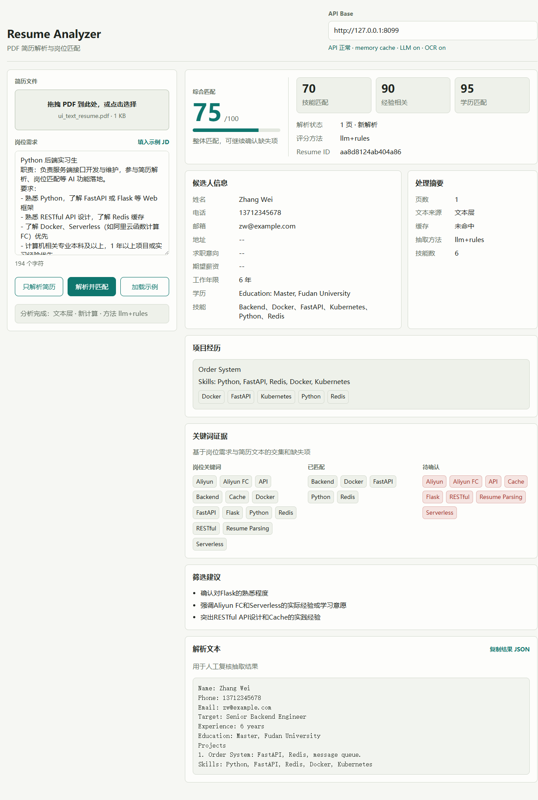

# AI Resume Analyzer

AI 赋能的智能简历分析系统，面向 Sidereus AI Python 后端/全栈实习生笔试题实现。项目提供 PDF 简历上传解析、关键信息抽取、岗位关键词分析、匹配度评分、缓存和静态前端页面。

GitHub 仓库：https://github.com/GeoSyntax/sidereus-resume-analyzer

前端演示：https://geosyntax.github.io/sidereus-resume-analyzer/

后端 API（阿里云函数计算 FC）：https://resume-yzer-api-qfiqdkwrkd.cn-hangzhou.fcapp.run

- 健康检查：https://resume-yzer-api-qfiqdkwrkd.cn-hangzhou.fcapp.run/health
- 能力清单：https://resume-yzer-api-qfiqdkwrkd.cn-hangzhou.fcapp.run/api/v1/capabilities

前端页面在 GitHub Pages 域名下会自动指向该后端地址，评审无需手动配置即可上传 PDF 验收。

## 界面预览



一次分析同时给出：综合匹配分与技能/经验/学历三维子分、候选人结构化信息、项目经历、岗位关键词的「已匹配 / 待确认」证据、筛选建议，以及可复核的解析原文与结果 JSON。

## 使用方法

### 线上验收（推荐）

1. 打开前端演示地址：<https://geosyntax.github.io/sidereus-resume-analyzer/>。页面右上角的 API Base 已自动指向线上阿里云 FC 后端，无需手动填写；顶部状态栏会显示「API 正常」和已启用的能力（LLM / OCR / 缓存类型）。
2. 在左侧「简历文件」区域拖入或点击选择一个 PDF 简历（单个文件，≤ 8 MB）。
3. 在「岗位需求」文本框粘贴岗位描述；也可点击「填入示例 JD」快速载入一份示例。
4. 点击操作按钮：
   - **解析并匹配**：解析简历并与岗位需求计算匹配度（完整流程）。
   - **只解析简历**：仅做解析与关键信息抽取，不做岗位匹配。
   - **加载示例**：无需后端即可查看一份示例结果，了解结果结构。
5. 查看右侧结果：综合匹配分、技能/经验/学历三维子分、候选人信息、项目经历、关键词证据（岗位关键词 / 已匹配 / 待确认）、筛选建议。点击「复制结果 JSON」可导出结构化结果。

> 说明：线上后端为按量付费的 Serverless 实例，首次请求可能有几秒冷启动；启用 LLM 时单次分析约 10 余秒属正常。

### 命令行快速验证

```bash
# 健康检查
curl https://resume-yzer-api-qfiqdkwrkd.cn-hangzhou.fcapp.run/health

# 无状态一次完成：解析 + 匹配（multipart form）
curl -X POST https://resume-yzer-api-qfiqdkwrkd.cn-hangzhou.fcapp.run/api/v1/analyze \
  -F "file=@your_resume.pdf;type=application/pdf" \
  -F "job_description=Python 后端实习生，熟悉 FastAPI、Redis、Docker、RESTful API，本科。"
```

返回 JSON 同时包含 `resume`（解析与抽取结果）与 `match`（匹配评分，未提供 `job_description` 时为 `null`）。

## 功能

- 上传单个 PDF 简历，解析多页文本并清洗分段
- 扫描件（无文本层）自动回退到视觉模型 OCR；未配置视觉模型时返回明确的 422 提示
- 抽取姓名、电话、邮箱、地址等必选字段
- 抽取求职意向、期望薪资、工作年限、学历、项目经历和技能关键词
- 根据岗位描述提取关键词并计算匹配度评分
- 支持可选 OpenAI 兼容模型增强抽取与评分；无 API Key 时使用规则引擎降级
- 支持 Redis 缓存；未配置 Redis 时自动使用进程内缓存
- 提供可部署到 GitHub Pages 的静态前端
- 提供阿里云函数计算 FC 自定义运行时部署配置
- 提供公开示例模式、评分标准映射和技术面试准备文档

## 技术栈

- 后端：Python（本地 3.10+ 开发，线上运行于阿里云 FC `custom.debian10` 内置的 Python 3.10）、FastAPI、Pydantic、pypdf、httpx
- 缓存：Redis 可选，内存缓存兜底
- AI：OpenAI Chat Completions 兼容接口可选
- 前端：原生 HTML/CSS/JavaScript，适合 GitHub Pages 静态部署
- 测试：pytest
- CI/CD：GitHub Actions（后端测试、前端 Pages 部署）

## 目录结构

```text
.
├── backend/
│   ├── app/
│   │   ├── main.py                 # FastAPI 入口
│   │   ├── models.py               # 响应与领域模型
│   │   └── services/
│   │       ├── pdf_parser.py        # PDF 文本解析
│   │       ├── text_cleaner.py      # 文本清洗与分段
│   │       ├── extractor.py         # 规则 + LLM 信息抽取
│   │       ├── matcher.py           # 岗位分析与评分
│   │       ├── keywords.py          # 技能关键词词表
│   │       ├── ai_client.py         # OpenAI 兼容调用
│   │       └── cache.py             # Redis/内存缓存
│   ├── tests/
│   ├── requirements.txt
│   ├── requirements-prod.txt
│   ├── Dockerfile
│   └── bootstrap                   # 阿里云 FC 自定义运行时启动脚本
├── frontend/
│   ├── index.html
│   ├── styles.css
│   └── app.js
├── serverless/
│   └── s.yaml                      # Serverless Devs / 阿里云 FC 配置
├── docs/
│   ├── EVALUATION_MAPPING.md       # 评分标准映射
│   ├── INTERVIEW_PREP.md           # 技术面试准备
│   └── BACKEND_DEPLOYMENT.md       # 后端部署到阿里云 FC
├── scripts/
│   ├── build_fc_package.ps1        # Windows 构建 FC 部署包
│   └── build_fc_package.sh         # Linux/macOS 构建 FC 部署包
├── DESIGN.md
└── README.md
```

## 本地运行

```bash
cd backend
python -m venv .venv
.venv\Scripts\activate
pip install -r requirements.txt
python -m uvicorn app.main:app --reload --host 127.0.0.1 --port 8000
```

打开前端：

```bash
cd frontend
python -m http.server 5173
```

浏览器访问 `http://127.0.0.1:5173`，API Base 使用默认的 `http://127.0.0.1:8000`。

## 环境变量

复制 `backend/.env.example` 为 `backend/.env` 后按需配置：

```bash
APP_ENV=local
CORS_ORIGINS=http://localhost:5173,http://127.0.0.1:5173
MAX_UPLOAD_MB=8
CACHE_TTL_SECONDS=86400
OPENAI_API_KEY=
OPENAI_BASE_URL=https://api.openai.com/v1
OPENAI_MODEL=gpt-4o-mini
REDIS_URL=
```

说明：

- 不配置 `OPENAI_API_KEY`：系统使用规则抽取和规则评分，可完整演示。
- 配置 `OPENAI_API_KEY`：系统会调用 OpenAI 兼容接口增强简历结构化抽取和匹配评分。
- 不配置 `REDIS_URL`：自动使用内存缓存。

## API

### 健康检查

```http
GET /health
```

### 一次完成解析与匹配（无状态，推荐）

```http
POST /api/v1/analyze
Content-Type: multipart/form-data

file=<resume.pdf>
job_description=<可选，岗位描述文本>
```

单次请求内完成「解析 + 抽取 +（可选）匹配」，不依赖服务端会话状态，适配 Serverless 多实例。返回 JSON 同时包含 `resume` 与 `match`（未提供 `job_description` 时 `match` 为 `null`）。前端线上主流程即调用此接口。

### 上传并解析简历

```http
POST /api/v1/resumes
Content-Type: multipart/form-data

file=<resume.pdf>
```

返回字段包含 `resume_id`、`cleaned_text`、`sections`、`profile` 和 `cached`。

### 获取缓存中的简历解析结果

```http
GET /api/v1/resumes/{resume_id}
```

### 分析岗位需求

```http
POST /api/v1/jobs/analyze
Content-Type: application/json

{
  "job_description": "Python 后端实习生，熟悉 FastAPI、Redis、RESTful API..."
}
```

### 岗位匹配评分

```http
POST /api/v1/resumes/{resume_id}/matches
Content-Type: application/json

{
  "job_description": "Python 后端实习生，熟悉 FastAPI、Redis、RESTful API，有 Serverless 部署经验..."
}
```

返回字段包含：

- `overall_score`：综合匹配分
- `skill_score`：技能匹配分
- `experience_score`：经验相关性分
- `education_score`：学历匹配分
- `matched_keywords` / `missing_keywords`
- `recommendations`

## 测试

```bash
pip install -r backend/requirements.txt
pytest
```

GitHub Actions 会在 push 和 pull request 时自动运行后端测试。

## 面试材料

- `docs/EVALUATION_MAPPING.md`：逐项对应评分标准，说明项目覆盖情况。
- `docs/INTERVIEW_PREP.md`：一轮/二轮技术面试讲解路线、常见追问和扩展方案。
- `docs/BACKEND_DEPLOYMENT.md`：阿里云 FC 后端部署步骤、GitHub Actions 部署和常见问题。
- `DESIGN.md`：设计目标、非目标、技术决策、缓存、安全和限制。

前端线上页面提供“加载示例”按钮，即使后端公网地址暂未部署，也可以让评审看到完整交互和结果展示。真实解析仍需要连接后端 API。

## 部署

### 后端部署到阿里云函数计算 FC

1. 安装并配置 Serverless Devs。
2. 根据需要在 `serverless/s.yaml` 中设置 `region`、函数名和环境变量。
3. 确保 `backend/bootstrap` 在 Linux 环境具备执行权限：

```bash
chmod +x backend/bootstrap
```

4. 部署：

```bash
cd serverless
s deploy
```

部署完成后，把函数计算 HTTP 触发器域名填入前端页面的 API Base。

### 前端部署到 GitHub Pages

1. 推送仓库到 GitHub，并确保默认分支为 `main`。
2. 在 GitHub 仓库 Settings -> Pages 中将 Source 设置为 GitHub Actions。
3. `.github/workflows/deploy-frontend.yml` 会把 `frontend/` 发布到 GitHub Pages。
4. 发布后访问 GitHub Pages 地址，在页面右上角 API Base 填入后端服务地址。

## 评分策略

规则评分由三部分加权：

- 技能匹配率：55%，比较岗位关键词与简历技能关键词的交集和缺失项。
- 工作经验相关性：30%，结合岗位要求年限、简历工作年限和项目数量。
- 学历匹配：15%，根据岗位学历要求和简历教育信息估算。

如果启用 LLM，系统会在规则结果基础上请求模型输出结构化 JSON，并通过 Pydantic 校验后再合并，避免模型输出破坏 API 契约。

## 已知限制

- 扫描版 PDF 依赖视觉模型 OCR：未配置视觉模型时，无文本层的扫描件会返回明确的 422 提示，而非静默失败。
- 内存缓存适合本地和单实例演示；Serverless 多实例/冷启动下内存缓存不跨实例，生产建议配置 Redis 获得持久缓存。
- LLM 调用会发送简历文本到配置的模型服务，真实生产需要加入用户授权、脱敏和审计。

## 提交信息模板

提交给 Boss 直聘面试官时可使用：

```text
GitHub 仓库地址：https://github.com/GeoSyntax/sidereus-resume-analyzer
线上演示地址：https://geosyntax.github.io/sidereus-resume-analyzer/
姓名与联系方式：<你的姓名 / 手机 / 邮箱>
```
